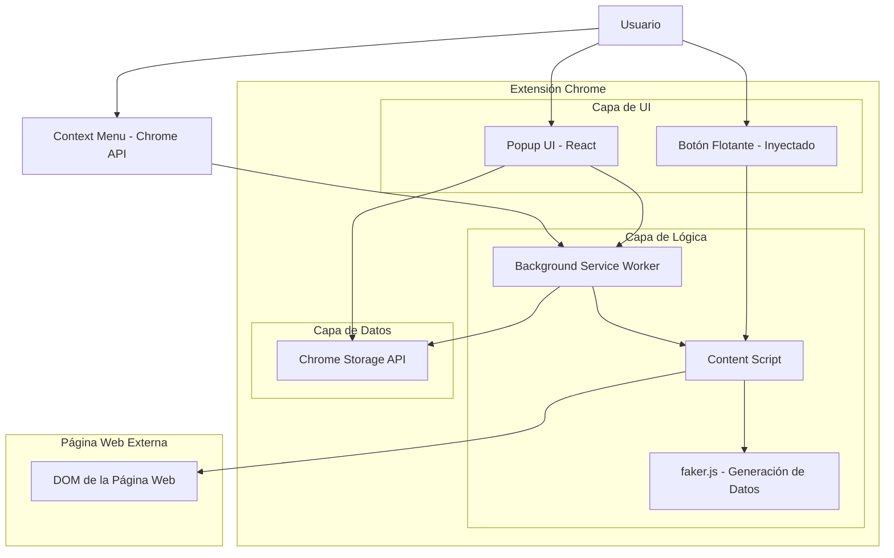
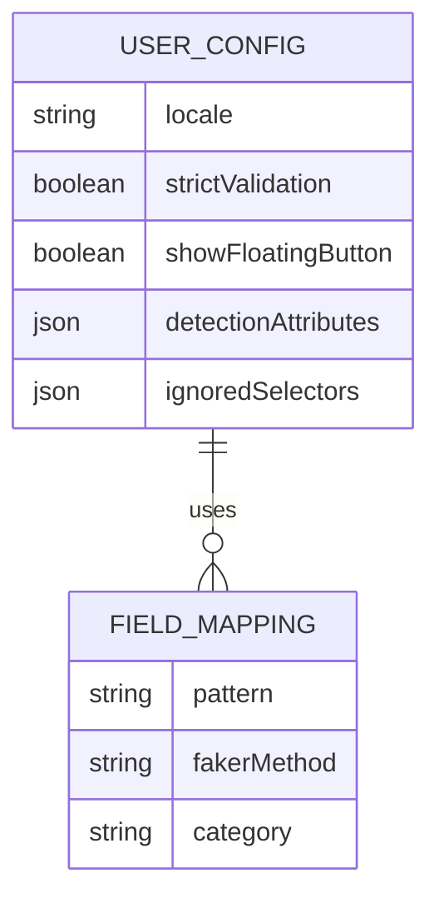
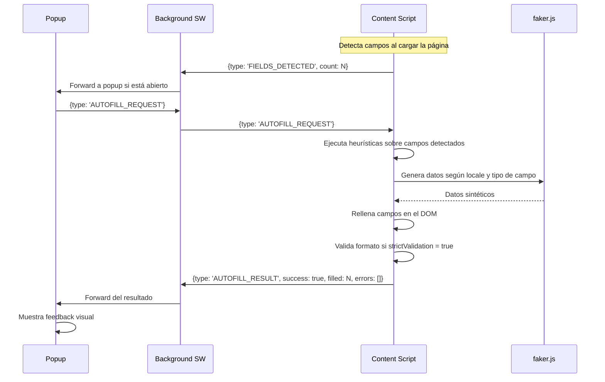

## 1. Diseño de Arquitectura



## 2. Descripción de Tecnologías

- **Frontend (Popup & Options)**: React\@18 + TypeScript + TailwindCSS\@3 + Vite

- **Runtime**: Chrome Extension Manifest V3

- **Generación de Datos**: @faker-js/faker\@9 (bundled)

- **Backend**: No requerido — toda la lógica se ejecuta en el navegador

- **Almacenamiento**: Chrome Storage API (sync + local)

## 3. Definición de Rutas (Popup / Options)

| Ruta             | Propósito                                                                        |
| ---------------- | -------------------------------------------------------------------------------- |
| `/` (popup.html) | Popup principal: botón autocompletado, detección de campos, configuración rápida |
| `/options.html`  | Página de opciones avanzadas: locale, heurísticas, campos ignorados              |

## 4. Estructura de Archivos

```
auto-form/
├── manifest.json              # Manifest V3
├── public/
│   ├── icons/                 # Iconos de la extensión (16, 48, 128)
│   ├── popup.html             # Entry point del popup
│   └── options.html           # Entry point de opciones
├── src/
│   ├── background/
│   │   └── service-worker.ts  # Service worker: context menu, mensajería
│   ├── content/
│   │   ├── detector.ts        # Detección de campos y heurísticas
│   │   ├── filler.ts          # Llenado de campos con faker
│   │   ├── floating-button.ts # Inyección del botón flotante
│   │   └── index.ts           # Entry point del content script
│   ├── popup/
│   │   ├── App.tsx            # Componente principal del popup
│   │   ├── components/        # Componentes UI del popup
│   │   └── main.tsx           # Entry point React del popup
│   ├── options/
│   │   ├── App.tsx            # Componente principal de opciones
│   │   ├── components/        # Componentes UI de opciones
│   │   └── main.tsx           # Entry point React de opciones
│   ├── shared/
│   │   ├── types.ts           # Tipos TypeScript compartidos
│   │   ├── constants.ts       # Constantes (locales, selectores)
│   │   ├── faker-factory.ts   # Factoría de instancias faker por locale
│   │   ├── heuristics.ts      # Lógica de heurísticas de detección
│   │   ├── validators.ts      # Validadores de formato (email, phone, zip)
│   │   └── storage.ts         # Wrapper de Chrome Storage API
│   └── vite-env.d.ts
├── tailwind.config.js
├── tsconfig.json
├── vite.config.ts
└── package.json
```

## 5. Modelo de Datos (Chrome Storage)

### 5.1 Esquema de Datos



### 5.2 Definición de Datos

**Configuración del Usuario** (Chrome Storage - sync)

```typescript
interface UserConfig {
  locale: 'es' | 'en' | 'pt_BR' | 'fr' | 'de' | 'it' | 'ja' | 'ko' | 'zh_CN'
  strictValidation: boolean
  showFloatingButton: boolean
  detectionAttributes: {
    name: boolean
    id: boolean
    placeholder: boolean
    label: boolean
    type: boolean
  }
  ignoredSelectors: string[]
}
```

**Mapeo de Campos** (Hardcoded en la extensión)

```typescript
interface FieldMapping {
  pattern: RegExp
  fakerMethod: string
  category: 'personal' | 'contact' | 'address' | 'payment' | 'misc'
}

// Ejemplos de mapeos:
const FIELD_MAPPINGS: FieldMapping[] = [
  { pattern: /(first[_-]?name|nombre)/i, fakerMethod: 'person.firstName', category: 'personal' },
  { pattern: /(last[_-]?name|apellido)/i, fakerMethod: 'person.lastName', category: 'personal' },
  { pattern: /(email|e-mail|correo)/i, fakerMethod: 'internet.email', category: 'contact' },
  { pattern: /(phone|tel|telefono|teléfono)/i, fakerMethod: 'phone.number', category: 'contact' },
  {
    pattern: /(address|direccion|dirección)/i,
    fakerMethod: 'location.streetAddress',
    category: 'address',
  },
  { pattern: /(city|ciudad)/i, fakerMethod: 'location.city', category: 'address' },
  { pattern: /(state|estado|provincia)/i, fakerMethod: 'location.state', category: 'address' },
  { pattern: /(zip|postal|cp)/i, fakerMethod: 'location.zipCode', category: 'address' },
  { pattern: /(country|pais|país)/i, fakerMethod: 'location.country', category: 'address' },
  { pattern: /(company|empresa|compania)/i, fakerMethod: 'company.name', category: 'misc' },
  { pattern: /(user|usuario|username)/i, fakerMethod: 'internet.username', category: 'contact' },
  { pattern: /(password|contraseña|pass)/i, fakerMethod: 'internet.password', category: 'contact' },
]
```

**Datos iniciales por defecto** (Chrome Storage - sync)

```typescript
const DEFAULT_CONFIG: UserConfig = {
  locale: 'es',
  strictValidation: true,
  showFloatingButton: true,
  detectionAttributes: {
    name: true,
    id: true,
    placeholder: true,
    label: true,
    type: true,
  },
  ignoredSelectors: [],
}
```

### 5.3 Permisos del Manifest V3

```json
{
  "manifest_version": 3,
  "permissions": ["activeTab", "storage", "contextMenus", "scripting"],
  "host_permissions": ["<all_urls>"],
  "content_scripts": [
    {
      "matches": ["<all_urls>"],
      "js": ["content-script.js"],
      "css": ["content-styles.css"],
      "run_at": "document_idle"
    }
  ]
}
```

### 5.4 Flujo de Mensajería entre Componentes



### 5.5 Algoritmo de Heurística de Detección

```typescript
// Orden de prioridad para identificar tipo de campo:
// 1. Atributo `type` (email, tel, number, url, etc.)
// 2. Atributo `name` (coincidencia con patrones regex)
// 3. Atributo `id` (coincidencia con patrones regex)
// 4. Atributo `placeholder` (coincidencia con patrones regex)
// 5. Texto del `<label>` asociado (atributo for, o label padre)
// 6. Atributo `autocomplete` si existe
// 7. Fallback: texto genérico según tipo de input

// Para elementos <select>:
// - Se selecciona una opción aleatoria válida (no disabled)
// - Se priorizan opciones no-placeholder (ej: "Seleccione..." se ignora)
```

### 5.6 Manejo de Errores

```typescript
// Estrategias de error handling:
// 1. Campos dinámicos (SPA): MutationObserver detecta nuevos campos inyectados
// 2. Campos deshabilitados/readonly: Se detectan y se omiten del autocompletado
// 3. Campos con validación compleja: Se generan datos que cumplen el patrón
//    del atributo `pattern` si existe
// 4. iframes same-origin: Se escanean y rellenan campos dentro de iframes
// 5. Campos con eventos custom: Se dispatchean eventos input/change/blur
//    para compatibilidad con React, Vue, Angular y vanilla JS
```
