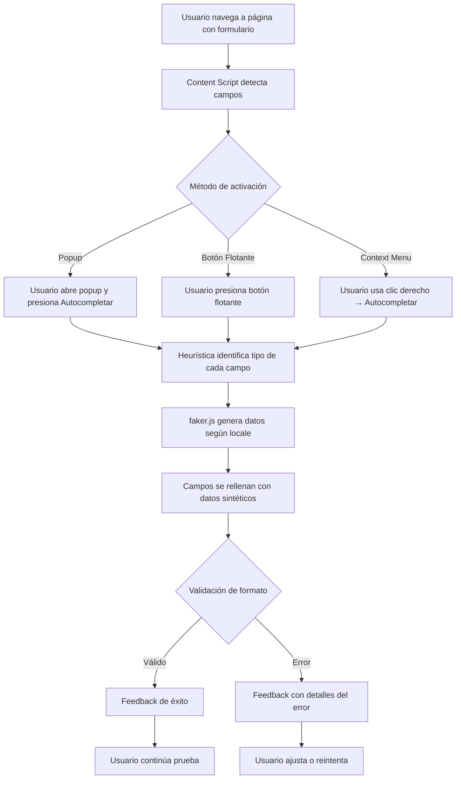

## 1. Resumen del Producto

**Auto-Form** es una extensión de Google Chrome que detecta y rellena automáticamente formularios web con datos sintéticos realistas generados por faker.js. Va dirigida a desarrolladores, QA testers y diseñadores UX que necesitan probar formularios de manera rápida y repetitiva sin introducir datos reales.

## 2. Funcionalidades Principales

### 2.1 Roles de Usuario

| Rol                            | Método de Acceso                                   | Permisos                                                    |
| ------------------------------ | -------------------------------------------------- | ----------------------------------------------------------- |
| Usuario (Tester/Desarrollador) | Instalación de la extensión desde Chrome Web Store | Acceso completo a detección, autocompletado y configuración |

> No se requiere registro ni autenticación. La extensión funciona tras la instalación.

### 2.2 Módulos Funcionales

La extensión consta de las siguientes vistas principales:

1. **Página Principal (Popup)**: botón de autocompletado, estado de detección de campos, configuración rápida de locale.
2. **Página de Configuración (Options Page)**: selección de locale, opciones avanzadas de generación, gestión de datos guardados.

### 2.3 Detalle de Páginas

| Página         | Módulo                        | Descripción                                                                                                            |
| -------------- | ----------------------------- | ---------------------------------------------------------------------------------------------------------------------- |
| Popup          | Botón de Autocompletado       | Botón principal que ejecuta el llenado automático del formulario activo en la pestaña actual                           |
| Popup          | Indicador de Detección        | Muestra la cantidad de campos detectados en la página actual (inputs, textareas, selects)                              |
| Popup          | Selector Rápido de Locale     | Dropdown para cambiar el idioma/región de los datos generados (es, en, pt, fr, de, etc.)                               |
| Popup          | Toggle de Validación Estricta | Switch para activar/desactivar la validación de formato en campos específicos (email, teléfono, código postal)         |
| Popup          | Botón de Limpiar Campos       | Limpia todos los campos rellenados en la página actual                                                                 |
| Popup          | Feedback Visual               | Muestra mensaje de éxito o error tras la operación de autocompletado                                                   |
| Options Page   | Configuración de Locale       | Selección detallada del locale de faker.js para la generación de datos                                                 |
| Options Page   | Configuración de Detección    | Opciones para ajustar la sensibilidad de la heurística de detección (por atributos name, id, placeholder, label, type) |
| Options Page   | Lista de Campos Ignorados     | Permite al usuario agregar selectores CSS de campos que deben ser ignorados durante el autocompletado                  |
| Options Page   | Restaurar Valores por Defecto | Botón para resetear toda la configuración al estado inicial                                                            |
| Context Menu   | Menú contextual del navegador | Opción "Autocompletar formulario" accesible desde clic derecho en cualquier página                                     |
| Botón Flotante | Botón sobre la página         | Botón flotante inyectado en la esquina inferior derecha de la página para activar el autocompletado con un solo clic   |

## 3. Flujo Principal

### Flujo del Usuario

1. El usuario instala la extensión desde Chrome Web Store.
2. Navega a cualquier página que contenga un formulario web.
3. La extensión detecta automáticamente todos los campos del formulario.
4. El usuario puede activar el autocompletado de tres formas:
   - Haciendo clic en el botón flotante sobre la página.

   - Abriendo el popup de la extensión y presionando "Autocompletar".

   - Usando el menú contextual (clic derecho → "Autocompletar formulario").

5. La extensión identifica el tipo de dato requerido por cada campo usando heurísticas.
6. Se generan datos sintéticos realistas con faker.js según el locale configurado.
7. Los campos se rellenan con los datos generados, respetando validaciones de formato.
8. El usuario recibe feedback visual del resultado (éxito/error con detalles).
9. Si es necesario, el usuario puede limpiar los campos desde el popup o re-ejecutar el autocompletado.

## 4. Diseño de Interfaz

### 4.1 Estilo de Diseño

- **Colores primarios**: #4285F4 (azul Chrome), #34A853 (verde éxito), #EA4335 (rojo error)

- **Colores secundarios**: #F8F9FA (fondo claro), #202124 (texto oscuro), #5F6368 (texto secundario)

- **Botones**: Esquinas redondeadas (8px), estilo Material Design flat con hover elevation

- **Tipografía**: "Segoe UI", Roboto, sans-serif. Tamaño base 14px, títulos 16px

- **Layout**: Card-based con espaciado consistente de 12px/16px

- **Iconos**: Material Icons (outline), 20px para acciones, 16px para indicadores

### 4.2 Diseño de Páginas

| Página         | Módulo                     | Elementos UI                                                                                               |
| -------------- | -------------------------- | ---------------------------------------------------------------------------------------------------------- |
| Popup          | Botón de Autocompletado    | Botón grande centrado, color #4285F4, texto blanco, icono de formulario, 100% ancho                        |
| Popup          | Indicador de Detección     | Badge con número, texto "X campos detectados", icono de check verde si >0                                  |
| Popup          | Selector Rápido de Locale  | Dropdown nativo con bandera emoji + nombre de locale, borde #DADCE0                                        |
| Popup          | Toggle Validación Estricta | Switch Material Design, etiqueta descriptiva a la izquierda                                                |
| Popup          | Botón Limpiar              | Botón secundario outline, color #5F6368, texto "Limpiar campos"                                            |
| Popup          | Feedback Visual            | Snackbar inferior, auto-oculta en 3s, verde éxito / rojo error con icono                                   |
| Options Page   | Configuración de Locale    | Grid de tarjetas con bandera, nombre de locale y radio button                                              |
| Options Page   | Configuración de Detección | Checkboxes agrupados por atributo (name, id, placeholder, label, type)                                     |
| Options Page   | Campos Ignorados           | Lista editable con input + botón agregar, items con icono eliminar                                         |
| Options Page   | Restaurar Valores          | Botón outline centrado en la parte inferior, color #EA4335                                                 |
| Botón Flotante | Botón sobre página         | Botón circular 48x48px, color #4285F4, icono blanco de formulario, sombra elevada, draggable verticalmente |

### 4.3 Responsividad

- **Popup**: Diseñado exclusivamente para tamaño fijo de 360px × 500px (tamaño estándar de popup de Chrome).

- **Options Page**: Desktop-first, responsive adaptable de 800px a 1200px con layout de dos columnas.

- **Botón Flotante**: Posicionamiento fixed, se adapta a cualquier resolución de página web. Soporta touch en dispositivos con pantalla táctil Chrome OS.
